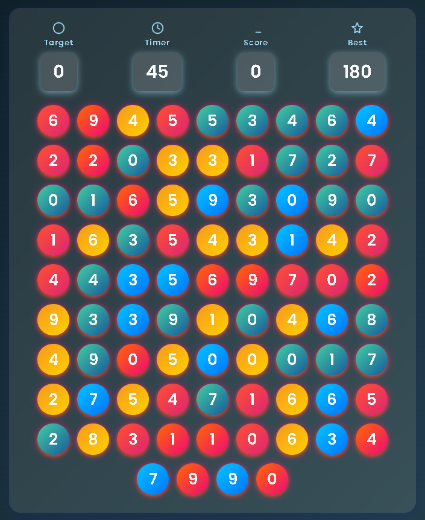

# Bubble Match Game

A simple, fast, and fun numbers game: click bubbles that match the target number to score points before the timer runs out.

## Preview


## Features
- Start screen with a classical card UI
- Timer countdown (60 seconds)
- Target number changes on every correct click
- Score: +10 for correct, -20 for incorrect (no negative scores)
- Best score saved in `localStorage`
- Responsive layout

## Project Structure
```
index.html   # Markup for start screen, scoreboard, and game area
style.css    # Styles (classical theme for start and game over cards)
script.js    # Game logic (timer, bubbles, scoring, UI updates)
```

## Run Locally
Just open `index.html` in your browser. No build step required.

- Windows: double-click `index.html`
- Or start a simple static server (optional):
  - Python 3
    ```cmd
    python -m http.server 8000
    ```
    Then open http://localhost:8000/

## How to Play
1. Click "Start Game".
2. Look at the Target value.
3. Click bubbles that match the Target.
4. Correct click: +10 points and bubbles regenerate with a new target.
5. Wrong click: -20 points (score won’t go below 0).
6. Beat your best score before time runs out!

## Deploy (GitHub Pages)
1. Push the repository to GitHub (done).
2. On GitHub: Settings → Pages → Build and deployment: set Source to "Deploy from a branch" and pick `main` and `/ (root)`.
3. Save. Your site will be available at `https://<your-username>.github.io/<repo>/`.

## Notes
- Best score persists via `localStorage` in the same browser.
- No external dependencies are required.

---
Made with HTML, CSS, and JavaScript.
